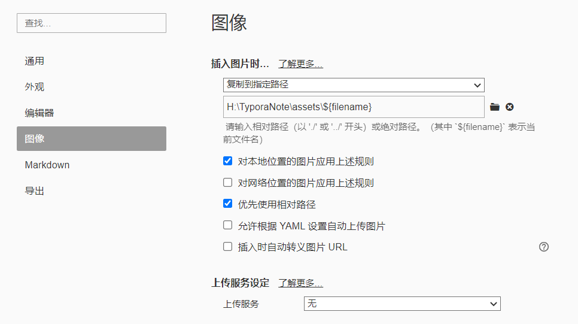
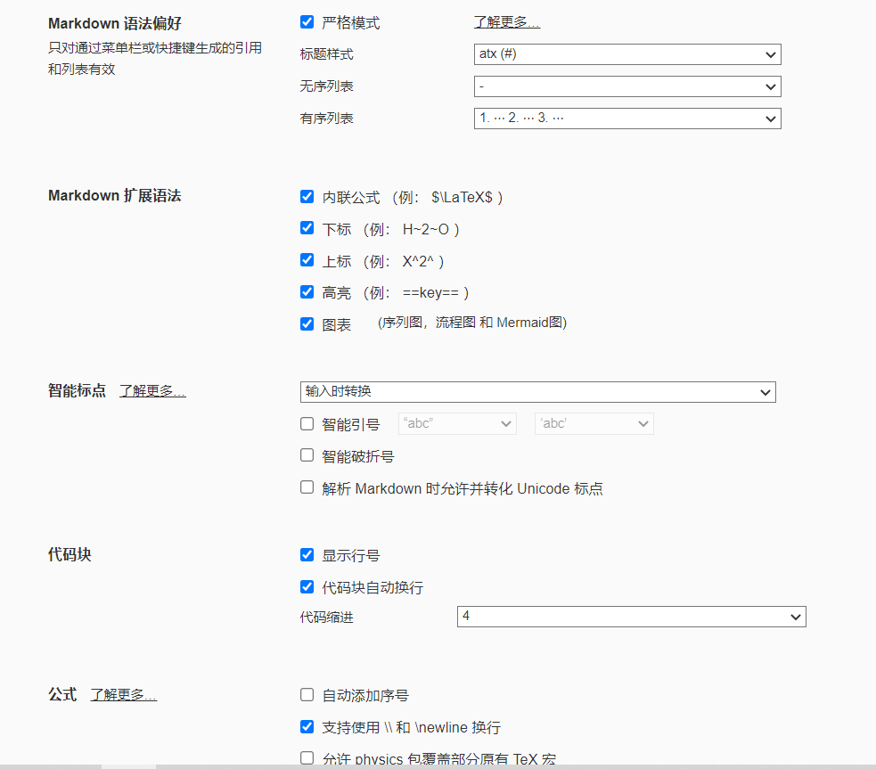
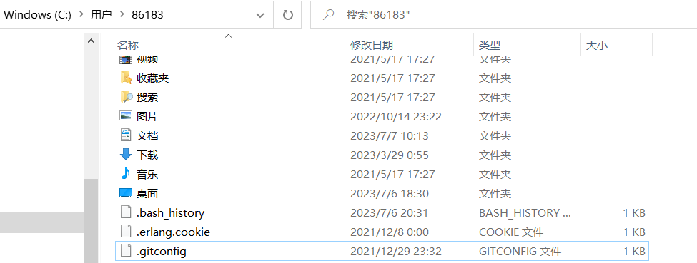

Typora实现云同步

# (1) 下载Typora并配置相关设置

1. 下载Typora：链接：https://pan.baidu.com/s/1Pz2beXAVFm88CgCanbCoWg 
   提取码：8tp2

2. Typora图像设置：图片插入设置为相对路径，实现在远程仓库也能显示图片。

   

3. Typora语法设置：

   

# (2) 安装git

1. 设置账户名与邮箱，设置成功后，可在C:\Users\86183\\**.gitconfig**目录下查看生成的配置文件；

   ```
   $  git config --global user.name "输入你的用户名"
   $  git config --global user.email "输入你的邮箱"
   ```

   

2. 生成SSH公钥与私钥，可在C:\Users\86183\\**.ssh**查看

   ```
   ssh-keygen -t rsa -C “输入配置的邮箱”
   cat ~/.ssh/id_rsa.pub //查看公钥
   ```


下载Quicker：[Quicker软件 您的指尖工具箱 - Quicker (getquicker.net)](https://getquicker.net/)